# xxoo
A fast tunnel proxy that helps you __bypass__ Great Firewalls
<center>
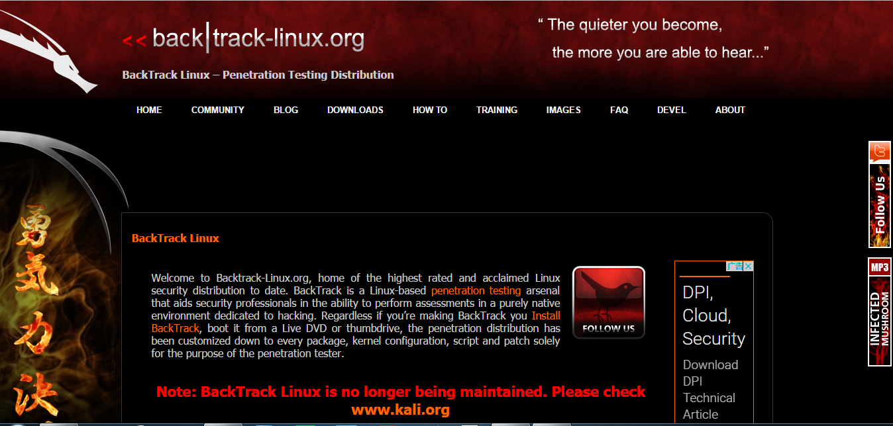


#**++*Across the Great Firewall, you can reach every corner in the world.*++**
#==AT&T==ACK   ON    Ti-Tan
#「那一天，人類終於回想起了，曾經一度支配他們的恐懼，還有被囚禁於鳥籠中的屈辱」


#*~~Two days ago the police came to me and wanted me to stop working on this. Today they asked me to delete all the code from GitHub. I have no choice but to obey~~.*
#*~~I hope one day I’ll live in a country where I have freedom to write any code I like without fearing.~~*
#*~~I believe you guys will make great stuff with Network Extensions.~~*
#*~~Cheers!~~*
#翻墙越岭玩 Pokemon Go


#==Keyword==:
##◇Read The Fucking Manual(Wiki)
##◇<< Back | Track
##◇==Google==/wiki/Feeds/Blogger/Wordpress
###https://program-think.blogspot.com/
###https://github.com/programthink
##◇==Github==/Markdown
##◇==XXOO==
##◇==ShadowSocks==/ShadowSocksR
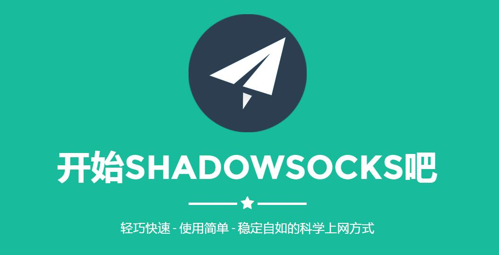
##◇Linux/==Ubuntu==/Deepin

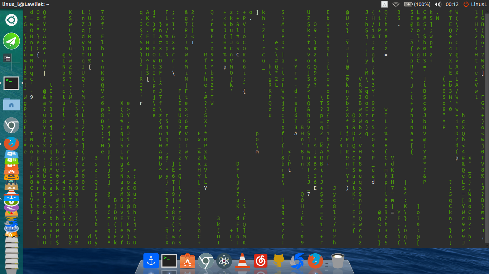
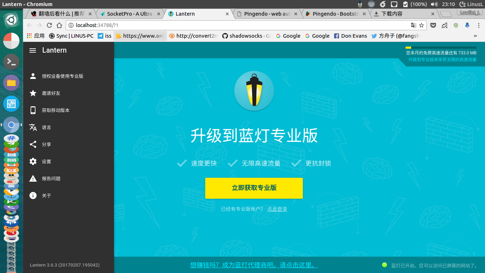
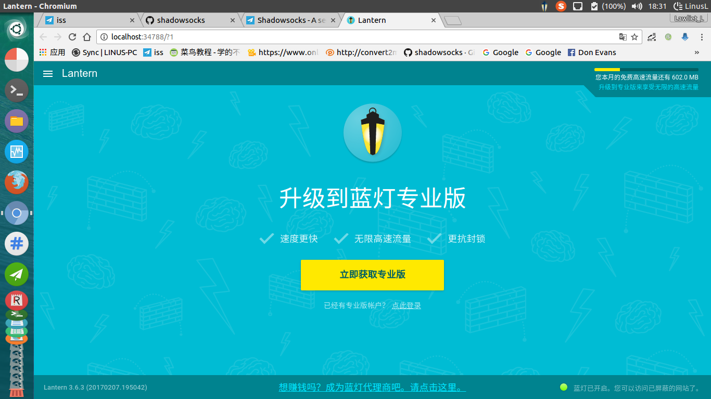
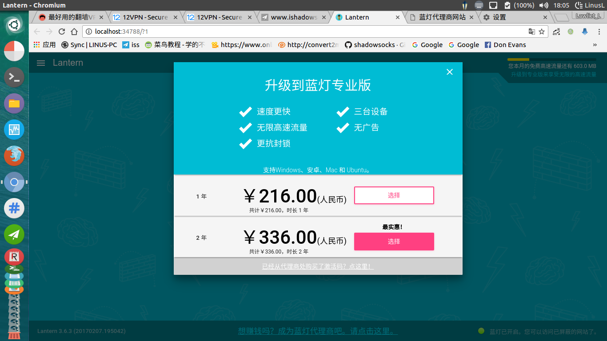
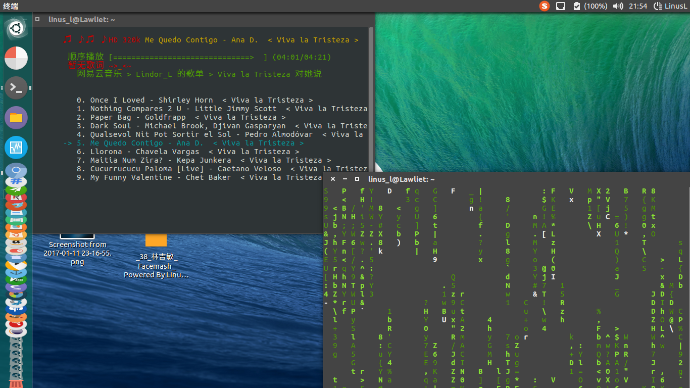


##◇Kali Linux
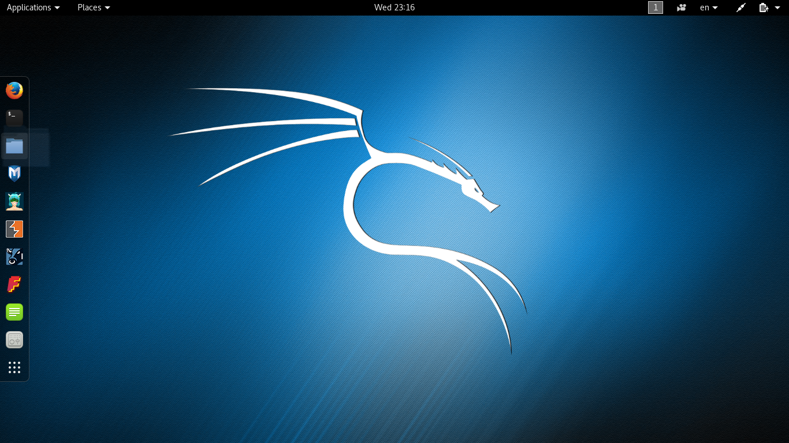
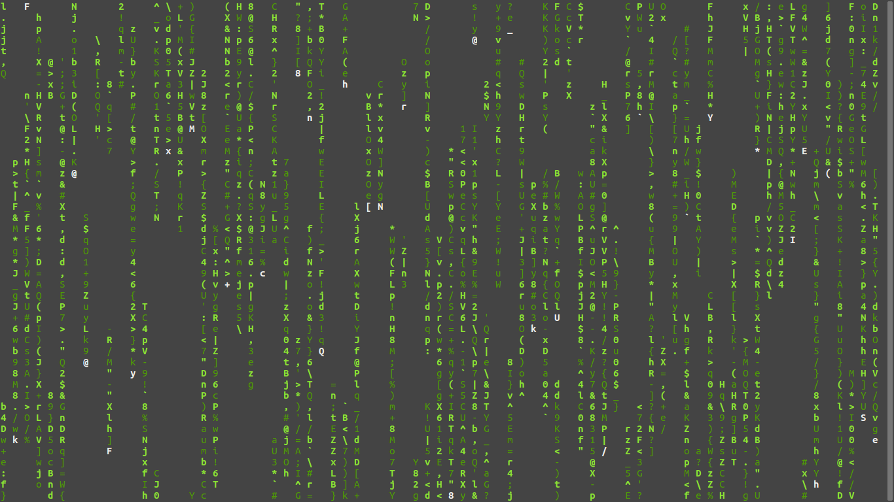

* * *

- - -

- - -

- - -


#★ https://cc.greatfire.org/en -扩展中国乃至全球的网络言论自由
## https://github.com/greatfire/wiki
##http://www.chinagfw.org/
### https://freebrowser.org/


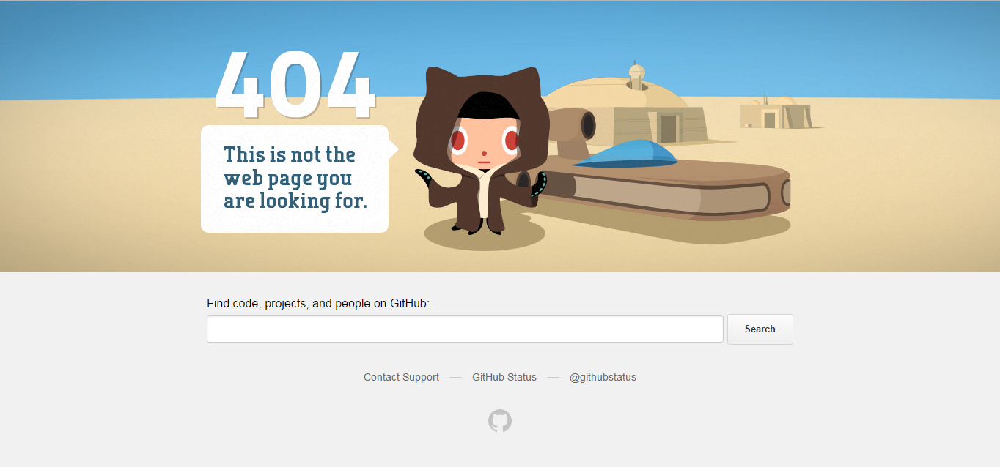
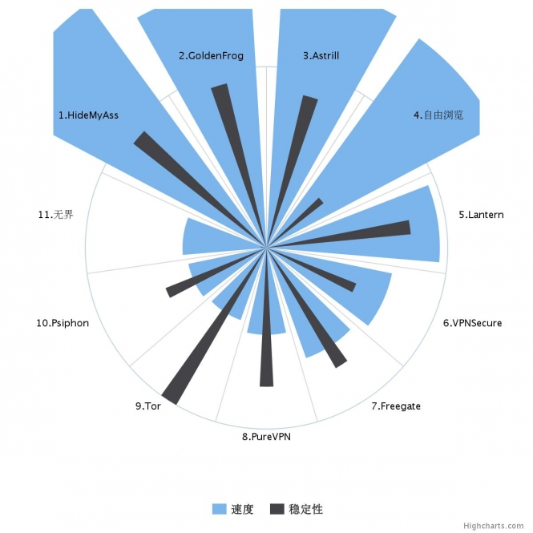

* * *

- - -

- - -

- - -

#★★https://fanqianghou.com/ -翻墙后看什么
##推荐被中国国家防火墙（==GFW==）封锁的中文资源，以及建议使用的服务
##https://www.fanqiangzhe.com/software/

###Mao Read The Fucking Manual

###The IT Crowd

* * *

- - -

- - -

- - -


#★★★https://github.com/racaljk/hosts -最新可用的google== hosts==文件
##https://coding.net/u/scaffrey/p/hosts/git
##https://github.com/lennylxx/ipv6-hosts （ipv6）
### 1. 用文本编辑器（如 Notepad++）打开 (如下图)：%SystemRoot%\System32\drivers\etc\hosts
### 2. 将 hosts 全部内容复制到上面的文件内

###修改 hosts 文件的原理是什么？
         DNS (Domain Name Server) 的作用就是进行 IP 解析，把域名对应到 IP。

          Hosts 文件本来是用来提高解析效率。Hosts请求级别高于DNS。

       为了方便用户记忆，我们将IP变成一个个的域名来输入到浏览器进行访问，而这使得访问网站时要先将其域名解析成 IP 。DNS (Domain Name Server) 的作用就是进行 IP 解析，把域名对应到 IP。

      在 Great FireWall 的 5 种封锁方法中，有一种简单而效果很好的方法是 DNS 污染。GFW 会对 DNS 的解析过程进行干扰，这会使对某些被干扰的域名返回一个错误的 IP 地址给你的主机，使你无法正确连接到你要的服务器上读取正确的信息。

       Hosts 文件本来是用来提高解析效率。在进行 DNS 请求以前，系统会先检查自己的 Hosts 文件中是否有这个地址映射关系，如果有则调用这个 IP 地址映射，如果没有再向已知的 DNS 服务器提出域名解析。也就是说 Hosts 的请求级别比 DNS 高。当你的 Hosts 文件里面有对应的 IP 时，它就会直接访问那个 IP，而不用通过 DNS。

       所以，当我们直接将 Google、Twitter、Facebook 之类的 IP 放入 Hosts 文件后，就可以跳过 DNS 的解析这一步，直接就行 IP 访问，不受 GFW 的 DNS 污染干扰了。

       补充一条，就是为什么 Hosts 的 IP 要时不时更改，为什么 FB、Twitter 会仍旧上不去。是因为 GFW 的第二个大招，IP 封锁。比如访问国外一个 IP 无法访问，Ping 不通，tracert 这个 IP 后发现，全部在边缘路由器 (GFW) 附近被拦截。换言之，GFW 直接拦截带有这个 IP 头的数据包。所以，如果你更改的 IP 被封锁了，就算你过了 DNS 这一关，也仍旧不能翻过 GFW。

###典型的hosts修改流程
替换或修改hosts文件
【Windows】 在开始屏幕搜索 “notepad”，右键选择 “以管理员身份运行” 记事本程序，按下 Ctrl+O 定位到 hosts 文件修改并直接保存。

【OS X】 在 Finder 窗口按下［前往］［前往文件夹…］，输入 /etc 回车，将 hosts 文件拖拽到桌面，双击修改保存，再将其拖拽回 /etc ，鉴定替换。

【Linux】 在终端运行命令 sudo vi /etc/hosts 修改。

【Android、iOS】 使用 iFile 或其它文件管理器应用修改 /etc/hosts，并照原样修改好权限和所有者。

修改完成之后，刷新 DNS 缓存。

刷新 DNS 缓存
【Windows】 按下 Windows+R 键，运行 cmd ，在命令提示符运行命令 ipconfig /flushdns

【OS X 10.9】【OS X 10.10.4+ 】在［应用程序］［实用工具］［终端］运行命令 sudo dscacheutil -flushcache; sudo killall -HUP mDNSResponder

【OS X 10.10】 在［应用程序］［实用工具］［终端］运行命令 sudo discoveryutil udnsflushcaches

【OS X 10.7 ~ 10.8】 在［应用程序］［实用工具］［终端］运行命令 sudo killall -HUP mDNSResponder

【Linux】 在［终端］运行命令 /etc/rc.d/init.d/nscd restart

【Android、iOS】 重新启动设备


* * *

- - -

- - -

- - -

#★★★★https://github.com/shadowsocks
##http://www.ishadow.site/   http://iss.pm/   http://iss.pm/   http://iss.pm/
##https://shadowsocks.org/en/download/clients.html
##Shadowsocks（影梭，简称SS）是近年出现的一种基于Socks5代理的翻墙软件，比起VPN，Shadowsocks更难被GFW发现和封锁，速度和稳定性也都很好。但目前主要问题是市面上还没有出现任何一家特别值得信赖的服务商提供付费的Shadowsocks服务，很多技术型翻墙者都是自己搭建Shadowsocks服务器供自己和朋友使用。如果您属于“极客翻墙者”，可以考虑购买位于海外的VPS来搭建自己的Shadowsocks服务器。比如可以使用DigitalOcean的低价VPS（每月5美元）。搭建服务器时VPS的地理位置很重要，建议选择位于日本或美国西海岸（San Francisco或Los Angeles）的服务器。网上可以找到一些安装Shadowsocks服务器的教程（如：这一篇）。安装好服务器后，可以使用Shadowsocks官网上推荐的那些客户端软件或APP来链接服务器、实现翻墙。
```bash
pip install shadowsocks
apt-get install shadowsocks-libev
```
```bash
sudo add-apt-repository ppa:hzwhuang/ss-qt5
sudo apt-get update
sudo apt-get install shadowsocks-qt5

```


###clowwindy
#$$作者 @Clowwindy 喝茶事件
https://prinzeugen.net/about-clowwindy-archive/

有幸从事件初露端弥的时候就得知消息，这里整理了一下事件的时间轴。希望这点资料能帮助到别人。另外，为了不影响首页阅览体验，本博客已经将其他关于 shadowsocks 的新闻放入 Chamber，不再在首页上显示。可以点 这里 访问 Chamber 分类目录。以后更新都会在这篇文章中更新，首发与 2015.8.22，以后此文章将会随着更新而修改发布日期。
8.20
@clowwindy 就 @breakwa11 关于 shadowsocks-rss 开源协议问题发言
https://prinzeugen.net/about-shadowsocks-r/
8.20
根据 @clowwindy 的发言可以确定的具体喝茶时间
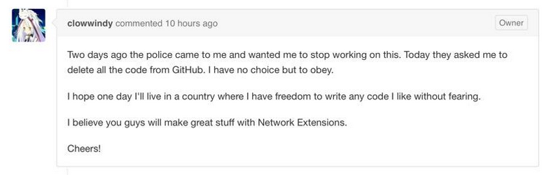
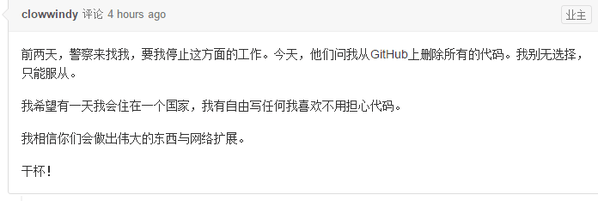
##Two days ago the police came to me and wanted me to stop working on this. Today they asked me to delete all the code from GitHub. I have no choice but to obey.
##I hope one day I’ll live in a country where I have freedom to write any code I like without fearing.
##I believe you guys will make great stuff with Network Extensions.
##Cheers!
https://github.com/shadowsocks/shadowsocks-iOS/issues/124 (web archive)
8.20 晚
访问 V2EX shadowsocks 节点跳转到首页
https://prinzeugen.net/disappearance-of-v2ex-shadowsocks-node/
根据 ＠livid 在 这里 32楼的发言来看，shadowsocks 节点并非被移除而是对注册时间少于 1000 天的用户隐藏了
8.20 晚
@clowwindy 把他所维护的几个 shadowsocks 实现的代码仓库内的 Issue 面板全部关闭，所有帮助信息全部删除，所有的描述都改成了 Something happened。另外，他还清空了该组织的 membership，或者将所有成员全部转入隐私状态，不对外公开。
https://typeblog.net/life/2015/08/21/long-live-shadowsocks.html
8.21
传出 @clowwindy 被请去喝茶的消息
https://prinzeugen.net/pray-for-clowwindy/
他在 shadowsocks-windows 的 #305 issue 下回复道
I was invited for some tea yesterday. I won’t be able to continue developing this project.
同时开启了 twitter 的隐私保护，除先前关注者外无法查看动态


8.21 晚
@clowwindy 发布了 thanks. 后的推文，证明人没事
https://prinzeugen.net/thanks-clowwindy/
8.21 晚
shadowsocksR 作者 @breakwa11 表示会继续开发新版本，@clowwindy 对其致谢
https://prinzeugen.net/the-author-of-shadowsocks-rss-will-keep-developing-new-version/
8.22
@clowwindy 删除所有 github 上的 shadowsocks 仓库，之前在 twitter 上发布了删除的相关动态。
https://prinzeugen.net/clowwindy-has-removed-all-repository-of-shadowsocks-on-github/
同时 @clowwindy 明确表示不会继续开发 shadowsocks 项目

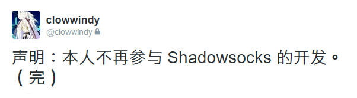
8.24
@breakwa11 发布 ShadowsocksR C# v3.4.0
https://prinzeugen.net/shadowsocksr-new-release/
8.25
@breakwa11 发布 SSR 更新计划
https://github.com/breakwa11/shadowsocks-rss/issues/35
其他关于 shadowsocks-R 以及 goAgent 的新闻窝就不贴了。
以上。如有错误请指出。
#$$SS 的产生
https://typeblog.net/say-goodbye-to-v2ex/

##很久很久以前
Long long ago, 在一个叫 v2ex 的地方，有一位叫做 clowwindy 的用户。他为了避免 网络流量分类技术 和 ssh tunnel 的低效，自己写了一个用于加密流量的协议，并 自用了一年多. 后来，由于这个协议非常高效，而且使用json 作为配置文件，配置起来非常方便，所以迅速赢得了很多用户，并在 v2ex 上有了一个专属的节点。shadowsocks 迅速被移植到各种平台、各种语言，用户也急剧上升，并且有了专门经营 shadowsocks 服务的商家。
##近期
最近，网络流量分类技术 有了迅速发展的趋势，各种 VPN 服务被迅速屏蔽。而 shadowsocks 的用户量急剧上升必然引起注意，由于 shadowsocks 的协议设计考虑过 网络流量分类技术 ，所以直接屏蔽起来比其他的协议要稍难一些（没错，是稍难一些，按特征屏蔽仍然是可能的）。自从 红旗文稿发布了一篇文章 以后，屏蔽的速度越来越快，而 shadowsocks 就被追查到了发源地 —— v2ex 。这个地方不仅仅有 shadowsocks ，还有各种 VPN 技术的交流。从春节前开始，shadowsocks 节点就被定向干扰，而最近，整个 v2ex 都被当作关键字加入了屏蔽列表。
##以后
偌大一个社区必然不会因为被屏蔽就轰然倒塌。但是，至少，这给上这个社区增加了一定的门槛（虽然 https 流量还没有被完全屏蔽）。也许这也可以给社区过滤一些垃圾用户吧，也许也可以少一些广告吧。
但是社区真的受益了吗？很明显不是的。创始人 Livid 自己也说了，v2ex 一开始就想 以自我审查来避免官方审查，但是很显然，这已经不起作用了。每当一个网站被屏蔽，都有人说这是自找的，但是，真的应该这么做吗？
不管怎么说，v2ex 已经被加上特技了，那些 duang duang duang 的也不会因为被屏蔽就上不了 v2ex 。能上的依然上他们的 v2ex，不知道的人依然不知道。也许这就是一种麻木吧。话又说回来，如果大家都不麻木的话，网络流量分类技术 这种东西怎么可能被成功建立起来。
==他们屏蔽Facebook的时候，我没有说话，我用人人网
他们屏蔽Google的时候，我没有说话，我用百度
他们屏蔽Gist的时候，我没有说话，我用Pastebin
但现在他们又向我的v2ex走来
我想说话，可是已经没有人响应我了==
#$$作者 @Clowwindy 论 SS 与 Shadowsocks.com 的关系
https://www.v2ex.com/t/166417?p=2

看你们吵的这么激烈，再澄清一下吧。

1. 当时几个版本内置的公共服务器流量爆了，打算把公共服务器给 @showfom 运营，并帮 @showfom 架设了服务。但没想到实际情况变成了用名气来进行宣传，也没想到这个服务会被用户当成“官方”，所以为了避免这种误解，加上精力也不够，还是取消了合作，没有收一分钱。在 Twitter 发过澄清，没在 V2EX 发是一个疏忽。至于在代码里加红字警告? Are you kidding? 一个开源项目，代码本身应该是中立的，是不应该有立场的。

2. 为了避免今后出现类似的情况，在这里做一个声明：Shadowsocks 是一个由很多人参与的开源项目，它只是一个程序，一套算法。这些人是以自由的形式凭自己的兴趣参与这个项目的，不存在“Shadowsocks 团队”，只存在贡献者。哪天现在的这些人不维护这些代码了，也会有其他人继续维护下去。至于 Shadowsocks 的使用，只要不违反开源授权，不会干涉。

3. 公共服务器还是免费，只是做了限速以免流量用超。OS X 版的公共服务器速度慢到不能用的时候直接关掉了。和 GFW 捉迷藏换 IP 的游戏，虽然已经半自动化，但一点也不好玩，你们明白 fqrouter 为什么要关了吧。

4. 从实际情况上来看，Shadowsocks 没有办法离开去中心化的服务器。要么自己花钱买 VPS，要么用有人分享的账号，要么用有人提供的付费服务，他们各有所长，适合不同的人。所以作为开发者，保持中立，不偏袒其中任何一方，顺其自然发展下去是最好的吧。

很多人要么一窝蜂的支持，要么一窝蜂的反对，还要把它给封禁掉，大概这种心理鲁迅先生也曾批判过。我还记得当年极路由在 V2EX 被冤枉的时候，也是一边倒的说极路由窃取隐私。如果你们真的那么讨厌商业，那你们应该首先把你们的苹果设备给摔了，因为它就是商业社会巅峰造极的产物。我反对不喜欢一个东西就要拿出简单粗暴的制裁手段，正是这种习性成就了 GFW。

维护这个项目到现在大概总共回复过几千个问题，开始慢慢想清楚了一件事，为什么会存在 GFW。从这些提问可以看出，大部分人的自理能力都很差，只是等着别人帮他。特别是那些从 App Store 下载了 App 用着公共服务器的人，经常发来一封只有四个字的邮件：“不能用了？” 我觉得这是一个社会常识，花一分钟写的问题，不能期待一个毫无交情的陌生人花一个小时耐心地问你版本和操作步骤，模拟出你的环境来帮你分析解决。Windows 版加上 GFWList 功能以来，我反复呼吁给 GFWList 提交规则，但是一个月过去了竟然一个提交都没有。如果没有人做一点什么，它自己是不会更新的啊，没有人会义务地帮你打理这些。最近 net-speeder 又开始流行，害人害己。我觉得，政府无限的权力，都是大部分人自己放弃的。假货坑爹，让政府审核。孩子管不好，让政府关网吧。有人在微博骂我，让政府去删。房价太高，让政府去限购。我们的文化实在太独特，创造出了家长式威权政府，GFW 正是在这种背景下产生的，一个社会矛盾的终极调和器，最终生活不能自理的你每天做的每一件事情都要给政府审查一遍，以免伤害到其他同样生活不能自理的人。这是一个零和游戏，越和这样的用户打交道，越对未来持悲观态度，觉得 GFW 可能永远也不会消失，而墙内的这个局域网看起来还似乎生机勃勃的自成一体，真是让人绝望。

顺便回答几个其它的问题吧。

1. 为什么项目的文档和网站是英文的？开源项目用英文来维护本来就是一个约定俗成的做法。网络审查和屏蔽不是一个国家的事情，而是一个世界性的问题。这些项目有很多其它国家的用户，也有一些国外的大牛作出过宝贵的贡献。

2. 参与的人只是凭兴趣做自己喜欢的事情，如果你的 issue 不像是一种思考和贡献，而更像是咨询客服，那被关掉了不要觉得惊讶。

#$$作者 @Clowwindy 说 ShadowsocksR
https://github.com/shadowsocks/shadowsocks-windows/issues/293#issuecomment-132253168
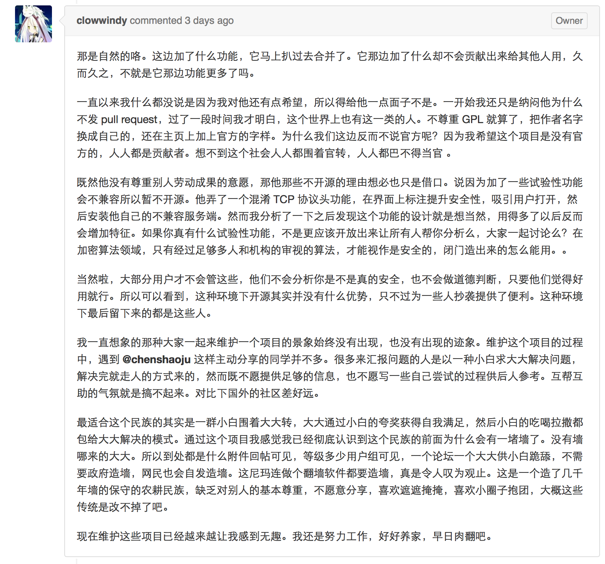
那是自然的咯。这边加了什么功能，它马上扒过去合并了。它那边加了什么却不会贡献出来给其他人用，久而久之，不就是它那边功能更多了吗。
一直以来我什么都没说是因为我对他还有点希望，所以得给他一点面子不是。一开始我还只是纳闷他为什么不发 pull request，过了一段时间我才明白，这个世界上也有这一类的人。不尊重 GPL 就算了，把作者名字换成自己的，还在主页上加上官方的字样。为什么我们这边反而不说官方呢？因为我希望这个项目是没有官方的，人人都是贡献者。想不到这个社会人人都围着官转，人人都巴不得当官 。
既然他没有尊重别人劳动成果的意愿，那他那些不开源的理由想必也只是借口。说因为加了一些试验性功能会不兼容所以暂不开源。他弄了一个混淆 TCP 协议头功能，在界面上标注提升安全性，吸引用户打开，然后安装他自己的不兼容服务端。然而我分析了一下之后发现这个功能的设计就是想当然，用得多了以后反而会增加特征。如果你真有什么试验性功能，不是更应该开放出来让所有人帮你分析么，大家一起讨论么？在加密算法领域，只有经过足够多人和机构的审视的算法，才能视作是安全的，闭门造出来的怎么能用。
当然啦，大部分用户才不会管这些，他们不会分析你是不是真的安全，也不会做道德判断，只要他们觉得好用就行。所以可以看到，这种环境下开源其实并没有什么优势，只不过为一些人抄袭提供了便利。这种环境下最后留下来的都是这些人。
我一直想象的那种大家一起来维护一个项目的景象始终没有出现，也没有出现的迹象。维护这个项目的过程中，遇到 @chenshaoju 这样主动分享的同学并不多。很多来汇报问题的人是以一种小白求大大解决问题，解决完就走人的方式来的，然而既不愿提供足够的信息，也不愿写一些自己尝试的过程供后人参考。互帮互助的气氛就是搞不起来。对比下国外的社区差好远。
最适合这个民族的其实是一群小白围着大大转，大大通过小白的夸奖获得自我满足，然后小白的吃喝拉撒都包给大大解决的模式。通过这个项目我感觉我已经彻底认识到这个民族的前面为什么会有一堵墙了。没有墙哪来的大大。所以到处都是什么附件回帖可见，等级多少用户组可见，一个论坛一个大大供小白跪舔，不需要政府造墙，网民也会自发造墙。这尼玛连做个翻墙软件都要造墙，真是令人叹为观止。这是一个造了几千年墙的保守的农耕民族，缺乏对别人的基本尊重，不愿意分享，喜欢遮遮掩掩，喜欢小圈子抱团，大概这些传统是改不掉了吧。
现在维护这些项目已经越来越让我感到无趣。我还是努力工作，好好养家，早日肉翻吧。
 
* * *

- - -

- - -

- - -

#★★★★★https://github.com/breakwa11
##https://github.com/breakwa11/shadowsocks-rss
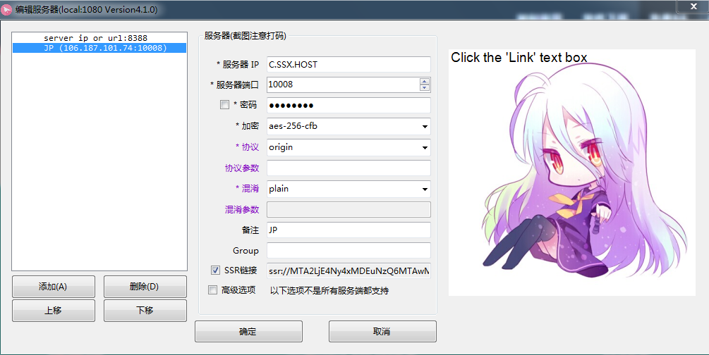
```bash
   apt-get install git
   git clone -b manyuser https://github.com/shadowsocksr/shadowsocksr.git

```

###breakwa11破娃酱
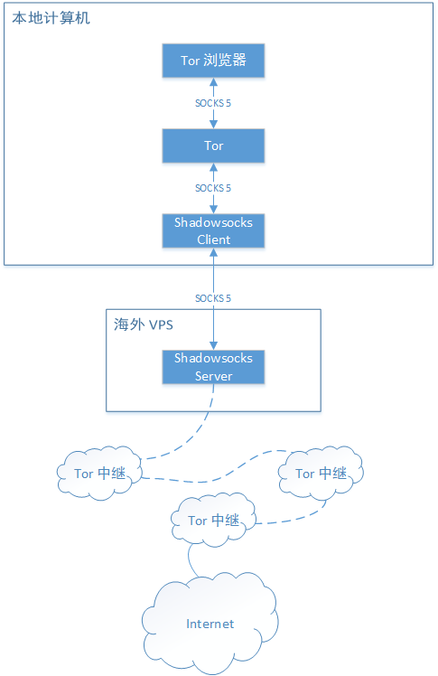

###ShadowSocksR原理


* * *

- - -

- - -

- - -

#★★★★★★https://github.com/XX-net/XX-Net/blob/master/code/default/download.md


* * *

- - -

- - -

- - -

#★★★★★★★https://github.com/getlantern/forum
##https://getlantern.org/


* * *

- - -

- - -

- - -

#★★★★★★★★https://psiphon.ca/


* * *

- - -

- - -

- - -

#★★★★★★★★★https://www.torproject.org/
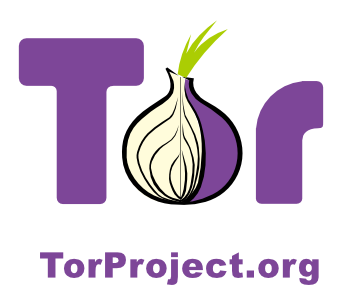

* * *

- - -

- - -

- - -

#★★★★★★★★★★https://freebrowser.org/ -自由浏览 是一个免费的安卓应用，可以提供不经审查的互联网接入。之所以免费提供是因为我们始终坚信不受审查的获取信息是每个人的天生的权利，并且也不应为此付出任何成本。
```js
<script async src="https://freebrowser.org/widgets/3.js"></script>
<!-- FreeBrowser.org 120x600 -->
<ins class="adsbyfreebrowser" style="display:inline-block;width:120px;height:600px"></ins>

```


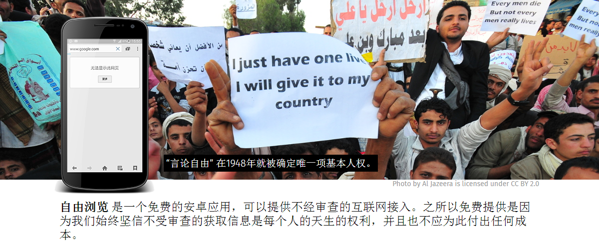

* * *

- - -

- - -

- - -

#**翻墙软件**
推荐！ 蓝灯（==Lantern==）最新版本下载，有桌面版和安卓版。本站有少量专业版激活码折扣转让，有意请邮件联系站长。速度更快，无限流量，不怕封锁。
推荐！Shadowsocks，一个用 Python 写的 socks 加密代理，技术宅的不二之选。最新详尽教程 另一教程 。推荐注册搭建所需要的VPS : DigitalOcean，请使用此链接 https://www.digitalocean.com/?refcode=ac2fc898c812 注册，本网站可以收到一点推荐费用。搭建一个完全免费的Shadowsocks服务器 收集了一堆SS账号不知哪个管用，可以用 超级逗比Ping （作者： @toyo13140010096 ）
适合未越狱的iOS设备翻墙 LightSword ，作者：@UnsignedInt8 。  项目主页 简明安装教程  iOS客户端
翻墙大杀器（@chinashiyu）。 代码仓库  安装脚本  安卓客户端  iOS客户端 shadowrocket 。
 VyprVPN ，有500M的免费流量，抗墙能力强，特别是安卓等移动设备。
萤火虫代理 开源翻墙工具，支持多平台。
赛风 （下载）由开放网络基金资助、多伦多大学的公民实验室（Citizen Lab）开发，安卓客户端持续可用，推荐。
自由浏览器，由Greatfire开发。（下载，链接在该页面最下方）自由微博（@FreeWeibo） 匿名和不受屏蔽的新浪微博搜索。
WoW Legacy 翻牆瀏覽器WowLegacy，基於Goagent重新開發，可一鍵翻牆。
动态网 （自由门下载 技术支持 有安卓版）调查显示最多人使用这个翻墙软件，建议和其他软件一并使用防止失效，注意更新。
无界浏览 （下载  有安卓版，在首页右上角） 目前仍有较多人使用的翻墙软件，建议和其他软件一并使用防止失效，注意更新。
Fqroute（@fqrouter）  简介 详细使用方法
最新免费翻墙软件墙内下载，支持各平台，更新维护 @suoluo （已经失效）。
GAE（Google App Engine） ，基本失效，不再推荐。包括：GoAgent ，是使用跨平台语言Python 开发的代理软件，利用GAE的服务器充當代理，幫助用戶瀏覽被封鎖的內容。（下载及教程  Gaeproxy论坛 教学视频）
VPN Gate  由全世界志愿者提供的公共 VPN 服务器获得自由访问互联网。VPNgate的开发者引入了一项新技术：P2P中继。简单来说，如果墙内有人连上了墙外志愿者提供的VPNgate服务器，那么他就自动成为了服务器，其他墙内的人就可以通过连上他来翻墙。（安装 下载 使用经验 墙内下载： ed2k://|file|client.zip|39134940|0C08A57D45DF3CEBBCBF5F0DBC202C56|/  ）
建议关注：P2P翻墙项目 Uproxy 的进展，谷歌翻墙利器。
实用工具：测试网站是否被墙（websitepulse.com  greatfire.org）  iaskfq 翻墙客服中心（@iaskfq）
商业服务：
在淘宝搜索“美国 游戏加速器”之类的关键词，即可轻松找到提供翻墙工具的服务商，问清楚是否只能访问特定游戏或购物网站。
PUFF，商業版SSH和VPN計劃提供低至50元每年的翻墙方案（购买联系 @stonehoo email: jinwei1014@gmail.com）
Asrill，英文，提供全球VPN服务，有米之人不要错过。（@astrill）
==


* * *

- - -

- - -

- - -

#**翻墙后先要做的几件事情：**

随时检查翻墙软件的更新情况，保证手头有两到三种可用的翻墙工具，发现失效马上检查更新版本。推荐！ 蓝灯（Lantern）最新版本下载，有桌面版和安卓版。本站有少量专业版激活码折扣转让，有意请邮件联系站长。速度更快，无限流量，不怕封锁。推荐 Shadowsocks，一个用 Python 写的 socks 加密代理，技术宅的不二之选。详尽教程 。推荐搭建所需要的VPS : DigitalOcean，注册请使用此链接 https://www.digitalocean.com/?refcode=ac2fc898c812 注册，本网站可以收到一点推荐费用。 搭建一个完全免费的Shadowsocks服务器  广告：购买专业、高速的Shaodowsocks服务。
注册和使用谷歌（Google）的系列服务，至少包括邮箱、搜索和G+；在美国的可以考虑 Google 的 Project Fi 手机服务，很好用，无缝切换wifi和蜂窝手机网络，国际漫游不另收费。很适合经常呆在手机信号不好的地方甚至完全没信号的场所的使用者（如地下室）和经常出国的人。有兴趣可以注册一个： https://g.co/fi/r/RPK5D9 。
注册和使用推特（Twitter），参考这个推荐中文信息列表，关注这200人，即可满足中文日常信息的大半需要。谢雪、中华合众国、Emma、艾曼妞、自由之春、环球焦点网、民主姑娘，六四XX周年、顾晓军、石三生等系列账号都是伪装成民运人士的受操纵的僵尸账号，专业抹黑攻击他人，请勿关注或转发。请关注本网站维护者 @wenyunchao 。本网站推荐的网站，在推特上大多有开设账号。
自由之家《中国媒体快报》简体中文版2016年12月号PDF版本下载，本期有莎拉∙库克撰写的“特写：北京2016年审查的重点”，不可错过。 请随手转发至同道群组 http://fhreports.net/ ，订阅请电邮：  cmb@freedomhouse.org 。在线浏览。
如果你觉得本网站对你有帮助，欢迎捐赠：Paypal: wenyunchao@gmail.com ，Bitcoin: 16SYFnHkAgs3L1QGAKeancENwKfXTH5xZy 。
赠品：给初级翻墙者立了一个书单： https://drive.google.com/folderview?id=0B8KDF8_HXe4IOWQzUUNRZTgwT2c&usp=sharing  基本上是历史书，以及我认为校订较好的《金瓶梅》。如果能把这些东西看完，相信中共灌输的狼奶能吐掉大半。没看过的也建议看看。
赠品：波黑围城战中的幸存者(A First-Hand Account of Long-Term SHTF Survival)  当中国大崩溃来临之际，个体在这种末世的混乱杀掠面前几乎无能为力，但总还是可以做些必要的准备，如远离城市，远离富人区，避居乡下，联络亲朋，储存硬通货和物资，详情可参考这篇文章。做足准备，生存的机会总会比别人大一些。

* * *

- - -

- - -

- - -
# **社交网站**

推特（Twitter）  一、使用推特进行强交互式阅读，别人会把有价值的内容自动推到你眼前，节省筛选时间，信息获取效率更高。二、把自己的观点发布到推特上，可以随时接受他人的检验。三、推特涨粉终极法则：持续提供有价值的信息，包括事实或观点。请关注本网站维护者 @wenyunchao 。（注册访问指南 推荐关注的中文信息  推荐关注的英文信息 强制使用手机注册页面即可跳过验证步骤： https://mobile.twitter.com/signup 。
脸书（Facebook）  港台及其他地方很多社会运动都是通过脸书发起，可前去参观学习。如：占领中环  。注册指引
Google+  中国用户较多，移动端可直接连接，电脑端需要修改hosts文件。中文用户手册 推荐关注对象 Lantern群组
Twister  这是一个有可能打败审查的利器！推荐安装试用完全去中心化的微博（推特），不用翻墙，不需要服务器，没有审查，信息没人能删除。

* * *

- - -

- - -

- - -
# 推**荐服务**

Google 搜索引擎，不二之选。建议尽量翻墙使用谷歌的服务，不解释。
Gmail 邮箱 安全常识1 安全常识2 启用两步验证 。
谷歌搜索（Google Search） 教程：从入门到精通4.0 ，能翻墙就让百度见鬼去吧。
谷歌云端硬盘（Google Drive） 共享与协作，可以快速提高工作效率，亦可方便发布文档到互联网。
Feedly，替代Google Reader的订阅器。 使用说明    部分新闻网站RSS
Dropbox 网盘
Blogger 及 WordPress 博客服务，本网站就是基于后者建的，绑了一个域名。
维基百科 。
#新闻网站

纽约时报中文网（推特账号：@nytchinese） 网站向中国读者介绍《纽约时报》的优秀作品，包括新闻、评论、时尚和文化等内容。其新闻专业性毋庸置疑。2012年10月26日，因刊登揭露温家宝家属累积27亿美元巨额财富的文章《总理家人的隐秘财富》后被墙。推荐：
万达帝国王健林：游刃于商业与权贵之间 寻找万达帝国背后的神秘股东 披露习近平家族与温家宝家族与巨贾之间的利益关系；
阿里巴巴上市背后的“红二代”赢家 江泽民、王震的孙子，温家宝、贺国强、刘云山、陈云的儿子…… 阿里巴巴声明证实报道 。
张洁平关于香港“占领中环”运动文章： 摊牌（一）：一国两制与民主香港 摊牌（二）：通向普选的巴别塔 。
吴伟：80年代政改系列谈
美国之音中文网 （@voachinese）美国之音是美国政府对外设立的国有宣传机构。内容较全面，中国新闻多集中于重大事件政策及解读、知名群体或人士的人权迫害等领域。（@voachina） 美国之音中文争鸣论坛，发布美国之音评论类节目精彩内容及推荐当下具代表性的时政经济评论作品。
朝日新闻中文网 刊载每日于日本国内发行的《朝日新闻》、朝日新闻官方网站以及应用程序“朝日新闻DIGITAL”内新闻报道的中译版本。
自由港（ @iyouport ）侧重传播关于民主自由的新闻与评论，通过互助共享的方式，实现优质精选的信息吞吐，并以此带来价值。
法广中文网（@RFI_Cn） 报道中国新闻的记者有多位是资深人士，常有靠谱独家报道。
BBC中文网（@bbcchinese） 由BBC中文部運作的一個中文新聞時事網站，面向全球华人并24 小时更新的新闻资讯和时事评论，但自2016年起已经不大涉及报道中国时政及人权方面的新闻。自1998年10月起即被墙，2008年因北京举办奥运会曾一度解封。
路透中文网（@ReutersCN 非官方） 路透中文网为中文读者提供世界热点地区经济新闻，突发事件报道，宏观经济报道，深度分析，观点评论和生活时尚资讯。2015年3月20日重新被墙。近年来涉及中国的人权报道已经从该网站上消失。
端传媒（@initiumnews ），香港新创办的新锐媒体。
自由微博（@FreeWeibo） 匿名和不受屏蔽的新浪微博搜索，由Greatfire开发维护。同时发布自由浏览器（下载，链接在该页面右侧）。
GFW BLOG（功夫网与翻墙）（@chinagfw） 提供网络安全、翻墙动态、翻墙观察及翻墙资源。
#从2015年3月，俺开始用 BT Sync 提供博客上【全部内容】的离线浏览，而且是【免翻墙】哦。你可以通过如下 BT Sync 密钥，进行自动同步。

B7P64IMWOCXWEYOXIMBX6HN5MHEULFS4V

（BT Sync 上的内容，大约1到2星期更新一次）
#https://ajax.aspnetcdn.com/chinese/#chinadigitaltimes
##中国数字时代（@CDTChinese） 加州大学柏克莱分校关于互联网自由的研究项目，是结合网络2.0 最新技术和网民群体智慧的新闻聚合网站。 推荐“真理部指令”、“敏感词库”及电邮订阅。
###全网查删澎湃新闻《北大研究团队:31城因PM2.5多死26万人 石家庄最多》一文。 【“真理部”是网民对中国共产党中央委员会宣传部和其下属的各省宣传部，以及国家级的国务院新闻办公室，中央文明办，国家广播电影电视总局，出版总署，文化部等一系列言论出版审查机构的总称。】 附：《北大研究团队:31城因PM2.5多死26万人石家庄最多》（澎拜新闻） 2月4日，中国首个评估PM2.5长期暴露对公众健康所产生影响的研究报告出炉。
##泡泡 | 未经审查的互联网信息 亚马逊免墙镜像
##通过中国数字时代(China Digital Times, CDT) 的免翻墙浏览器扩展可以在不翻墙的情况下阅读中国数字时代网站的所有内容，该插件支持谷歌浏览器与火狐浏览器，本文介绍在谷歌浏览器下安装及使用的方法。

此插件来自中国数字时代免翻墙插件项目，项目地址：https://github.com/cdtmirrors/cdt.unblocked

有两种方式安装安装，一种是访问谷歌应用店安装，一种是下载插件安装，下面分别介绍这两种方式，并在第三部分介绍基本的管理方式：

一、Chrome 网上应用店的安装介绍

下面介绍通过 Chrome网上应用店安装的步骤，也包括安装后如何隐藏与卸载的方式，需要在翻墙情况下操作，安装完成后，可以不翻墙使用。


